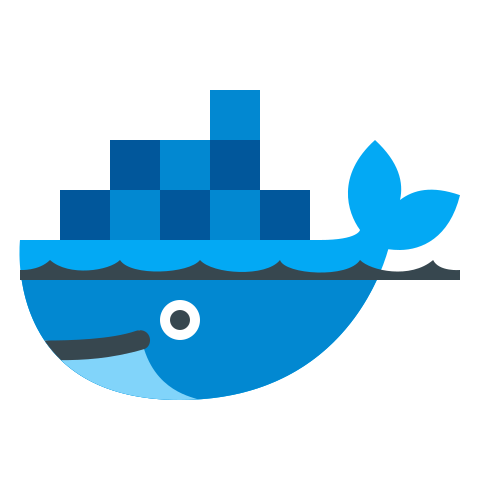
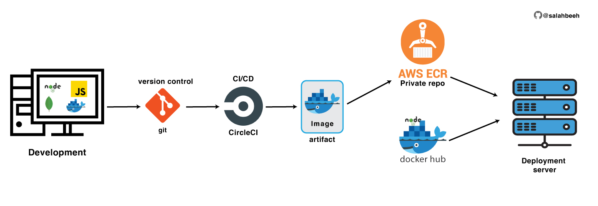

<h1 style="text-align:center"> Demo app - developing with Docker</h1>

_This app is orignally developed by [Nana Janashia](https://gitlab.com/nanuchi/developing-with-docker)_

<p align="center">

</p>


This demo app shows a simple user profile app set up using 
- index.html with pure js and css styles
- nodejs backend with express module
- mongodb for data storage

<p align="center">

</p>
<h6 style="text-align:center"> app deployment docker life cycle</h6>

All components are docker-based


## Get Started With Docker
---
**Step 1**: Create docker network

    docker network create mongo-network 

**Step 2**: start mongodb 

    docker run -d \
    -p 27017:27017 \
    -e MONGO_INITDB_ROOT_USERNAME=admin \
    -e MONGO_INITDB_ROOT_PASSWORD=password \
    --name mongodb \
    --net mongo-network \
    mongo    

**Step 3**: start mongo-express
    
    docker run -d \
    -p 8081:8081 \
    -e ME_CONFIG_MONGODB_ADMINUSERNAME=admin \
    -e ME_CONFIG_MONGODB_ADMINPASSWORD=password \
    -e ME_CONFIG_MONGODB_SERVER=mongodb \
    --net mongo-network \
    --name mongo-express \
    mongo-express   

_NOTE: creating docker-network in optional. You can start both containers in a default network. In this case, just emit `--net` flag in `docker run` command_

**Step 4**: open mongo-express from browser

    http://localhost:8081

**Step 5**: create `user-account` _db_ and `users` _collection_ in mongo-express

**Step 6**: Start your nodejs application locally - go to `app` directory of project 

    cd app
    npm install 
    node server.js
    
**Step 7**: Access you nodejs application UI from browser


## With Docker Compose


**Step 1**: start mongodb and mongo-express

    docker-compose -f docker-compose.yaml up
    
_You can access the mongo-express under localhost:8080 from your browser_
    
**Step 2**: in mongo-express UI - create a new database "my-db"

**Step 3**: in mongo-express UI - create a new collection "users" in the database "my-db"       
    
**Step 4**: start node server 

    cd app
    npm install
    node server.js
    
**Step 5**: access the nodejs application from browser 

    http://localhost:3000

### build a docker image from the application

    docker build -t my-app:1.0 .       
    
The dot "." at the end of the command denotes location of the Dockerfile.


### add docker volumes 

once you restart the container the data saved in the database will be dropped, in this case add _docker volumes_ to keep the consistancy.

* in the docker compose _yaml_ file add the following to each image:

```
    volumes:
     - mongo-data:/data/db   //named volume --> :/pointing/to/phyiscal/path/in_the_local_machine
```
_careful with the identation of the yaml file._  

### connect to private repo

will connect to **AWS ECR** (Elastic Container Registry):

**Prerequisites:**
* [AWS CLI](https://docs.aws.amazon.com/cli/latest/userguide/getting-started-install.html)
* AWS credientials

To get the credientials, create an IAM user with the right premssion with programmatic access, and download the credientials csv file.


then run the following command in you terminal, and enter the corresponding info from the csv file you already downloaded in the step above.
```
aws configure
```
now, from aws website console create an ECR:

then push the image you built to the private repo:

**Step 1** Retrieve an authentication token and authenticate your Docker client to your registry.
Use the AWS CLI:
```
aws ecr get-login-password --region <closest region to you> | docker login --username AWS --password-stdin <aws will provide you with the repo endpoint>
```

**Step 2** After the build completes, tag your image so you can push the image to this repository:
```
docker tag <app-name>:<version>  <repo end point/app-name:version>
```

**Step** Run the following command to push this image to your newly created AWS repository:
```
docker push <path or endpoint of the repo directory/image:version>
```


### pull the image from the private repo to the production/dev/testing server
```
docker run <endpoint to the repo/image:version>
```
that easy, as you are pulling it to your local machine.
